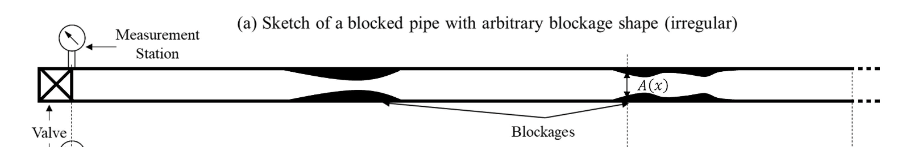
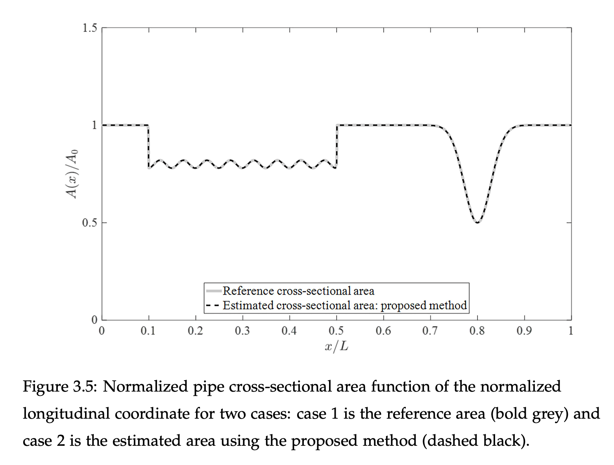

# Internal Pipe Area Reconstruction as a Tool for Blockage Detection

 [<image-card alt="License: MIT" src="https://img.shields.io/badge/License-MIT-yellow.svg" ></image-card>](https://opensource.org/licenses/MIT)

## 🎯 Overview

This repository provides a MATLAB function that solves the **inverse problem** of reconstructing the internal pipe area using a **single pressure measurement** at one location. The method enables detection of **extended blockages** and irregular area variations without requiring full knowledge of boundary conditions at the opposite end of the pipe.



Here is an example of the reconstruction:



### 🔍 Key Features

- Solves the inverse problem for 1D water hammer equations  
- Detects extended blockages from one pressure signal  
- Adaptable to detect **mixed-type defects** (leaks, discrete blockages) as described in [this paper](https://researchportal.helsinki.fi/en/publications/multiple-defects-detection-and-characterization-in-pipes)  
- Experimentally validated in [my PhD thesis](https://researchportal.hkust.edu.hk/en/studentTheses/internal-pipe-imaging-for-defect-detection-using-acoustic-waves)

- **MATLAB Version:** R2017a+  
- **Dependencies:** Base MATLAB

📌 To simulate pressure signals in pipes with multiple defects, use the companion repository:  
👉 [Hydraulic Transient MOC for Pipe with Multiple Defects](https://github.com/fzouari/hydraulic_transient_moc_pipe_defects)

## 📚 How to Cite

If you use this code in your research, please cite the following:

**BibTeX:**
```bibtex
@article{zouari2019internal,
  title={Internal pipe area reconstruction as a tool for blockage detection},
  author={Zouari, Fedi and Bl{\aa}sten, Emilia and Louati, Moez and Ghidaoui, Mohamed Salah},
  journal={Journal of Hydraulic Engineering},
  volume={145},
  number={6},
  pages={04019019},
  year={2019},
  publisher={American Society of Civil Engineers}
}
```

**APA:** Zouari, F., Blåsten, E., Louati, M., & Ghidaoui, M. S. (2019). Internal pipe area reconstruction as a tool for blockage detection. *Journal of Hydraulic Engineering*, *145*(6), 04019019. https://doi.org/10.1061/(ASCE)HY.1943-7900.0001602

## ⚠️ Notes

- Code is provided **as-is** from the original research and may contain debug lines or legacy formatting.
- For questions or issues, open an [Issue](https://github.com/fzouari/internal-pipe-area-reconstruction/issues).

## 🔗 Related

- Simulation Code: [Hydraulic Transient MOC for Pipe with Multiple Defects](https://github.com/fzouari/hydraulic-transient-moc-defects)
- Mixed-Type Defect Detection: [Conference Paper – Helsinki Portal](https://researchportal.helsinki.fi/en/publications/multiple-defects-detection-and-characterization-in-pipes)
- Experimental Validation: [PhD Thesis – HKUST Portal](https://researchportal.hkust.edu.hk/en/studentTheses/internal-pipe-imaging-for-defect-detection-using-acoustic-waves)
- Journal Paper: [DOI Link](https://doi.org/10.1061/(ASCE)HY.1943-7900.0001602)
- Follow-up Study: [DOI Link](https://doi.org/10.1061/(ASCE)HY.1943-7900.0001674)
- Network Extension: [arXiv Link](https://arxiv.org/abs/1909.05497)

## 📬 Contact

For questions, collaborations, or feedback, feel free to reach out via GitHub or connect through [LinkedIn](https://www.linkedin.com/in/zouari-fedi/).

## 🤝 Contributing

Contributions are warmly welcomed! Whether you're fixing bugs, improving performance, adding new features, or enhancing documentation, your input helps make this project better for everyone.

### 🛠 How to Contribute

1. **Fork the repository** and clone it locally.  
2. **Create a new branch** for your feature or fix:
   ```bash
   git checkout -b feature-name
   ```
3. **Make your changes** and ensure the code runs correctly.  
4. **Add tests** if applicable.  
5. **Commit and push** your changes:
   ```bash
   git commit -m "Add feature/fix"
   git push origin feature-name
   ```
6. **Open a pull request** describing your changes and why they should be merged.

### 📋 Guidelines

- Keep code clean and well-commented  
- Follow MATLAB best practices and naming conventions  
- Be respectful and constructive in discussions

### 💡 Ideas Welcome

If you have suggestions for improvements or new features, feel free to open an issue or start a discussion. Let’s build something great together!
